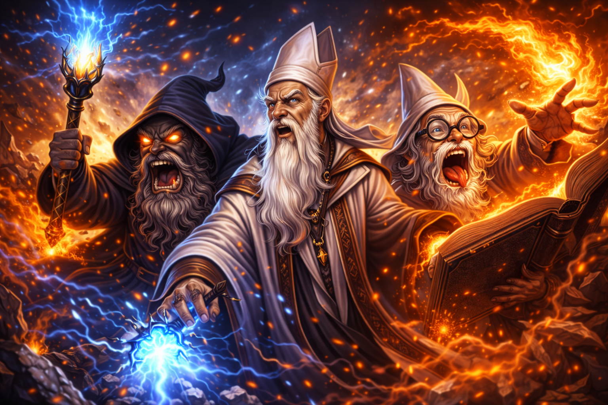
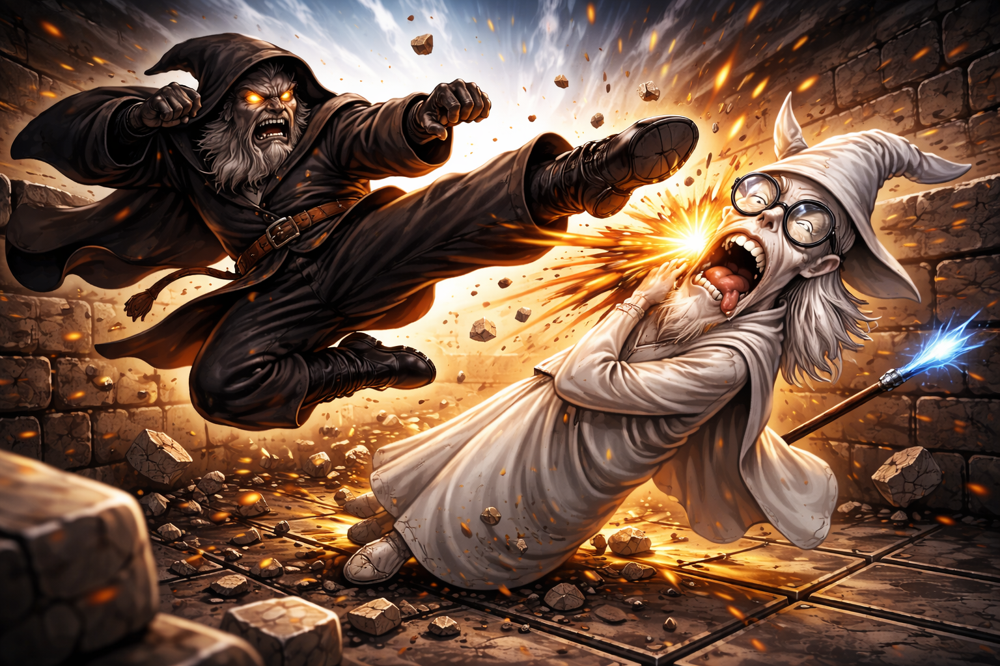

# 🧙‍♂️🧱 Wizard Walls (Alt Chess)

> Are the walls are made of... wizards?

**✨ Conjuration, destruction, and resurrection deathmatch.**

*Bend the arena, break your enemies, and bring the dead back to fight.*

## 🗣️ Explain

Each player commands a Bishop Wizard, Knight Wizard, and Rook Wizard. On every turn, players choose how to spend two actions; traditional Chess moves, placing walls, destroying walls or resurecting wizards.

## ❤️ Intent

The design intent of this game is to be a: fun, simple to learn, fast paced game that can be played with an existing standard Chess set.

# Wizard Walls Basic

## ⚠️ Requires
- 1x Chess board.
- 1x White bishop.
- 1x White Knight.
- 1x White Rook.
- 1x Black Bishop.
- 1x Black Knight.
- 1x Black Rook.
- 16x wall tokens (plastic/wooden/paper tokens).



## 🏗️ Setup

- White player places 3 wall tokens anywhere within middle 4 rows.
- Black player places 3 wall tokens anywhere within middle 4 rows.
- White player places their Bishop, Knight and Rook anywhere within their first 2 rows.
- Black player places their Bishop, Knight and Rook anywhere within their first 2 rows.
- Each player starts with 5 wall tokens in their hand.

## 🕹️ Play

Players take turns. 

White goes first.

Each turn the active player takes up to two actions from four choices:

1. **Move a wizard** that you control to an empty square (without a wall token). This is a standard Chess move that depends on if the chosen wizard is a Bishop (diagonal), Knight (L shape) or Rook (vertical or horiztonal). The Knight can jump over walls like it can jump standard Chess pieces, the Bishop and Rook cannot jump over walls.



2. **Conjure a wall** token from your hand immediately adjacent to any wizard(s) you control - killing any wizard on that square. If you have no remaining wall tokens in your hand then you cannot conjure a wall. You cannot place a wall token on an existing wall token. Elect which wizard conjured the wall.


3.  **Destroy a wall** token that is immediately adjacent to any wizard(s) you control - take the single selected wall token into your hand. Elect which wizard destroyed the wall.


4. **Resurrect a wizard** of yours that was previously destroyed - placing it in any square that is immediately adjacent to TWO other wizards you control - destroying any wizard or wall token(s) on that square - take any destroyed wall tokens into your hand.


Each wizard can only move once per turn.

Each wizard can only conjure a wall once per turn.

Each wizard can only destroy a wall once per turn.

Only one wizard can ever be resurrected per turn.

#### Examples valid turns:
```
1. Move Knight, move Rook.
2. Move Knight, build a wall with Knight.
3. Build a wall with Rook, move the Rook.
4. Build a wall with Bishop, move Rook.
5. Destory a wall with Knight, move Rook.
6. Destory a wall with Knight, build a wall with Rook.
7. Move Rook next to Knight, resurrect Bishop.
```

## 👑 Win

Points are gained for each Wizard destroyed equal to standard Chess piece rules. 

- The Knight is worth 3 points
- The Bishop is worth 3 points
- The Rook is worth 5 points

The first player to 10 or more points wins.

## 🕒 Draw

Like standard Chess **threefold repetition** allows a player to claim a draw if the exact same board position occurs three times, with the same player to move. It prevents endless games by ending the match when no real progress is made. A player must choose to claim the draw. 

## ⏳ Time

A strict maximum turn length can be enforced if both players agree. 

Tournament conditions require a strict maximum turn length.

If a player's time runs out then their turn is over, even if they have not completed their two actions.

Sample mobile friendly turn timer webapp: https://v0-board-game-timer-rho.vercel.app/


---

# Wizard Walls Full

## ⚠️ Requires
- 1x standard Chess set with all pieces.
- 16x wall tokens (plastic/wooden/paper tokens).

## 🏗️ Setup

- White player places 3 wall tokens anywhere within middle 4 rows.
- Black player places 3 wall tokens anywhere within middle 4 rows.
- **The White player chooses their team spending 11 points.
-- Pawns cost 1 point. Maximum of 8 Pawns. They move in any direction like a King moves in a standard Chess game. They cannot conjure walls, destroy walls or resurect Wizards.
-- Bishop cost 3 points. Maximum of 2 Bishops. They move diagonally as Bishop moves in a standard Chess game. They can conjure walls, destroy walls and resurect Wizards.
-- Knight cost 3 points. Maximum of 2 Bishops. They move in an L shape as a Knight moves in a standard Chess game.  They can conjure walls, destroy walls and resurect Wizards.
-- Rook costs 5 points. Maximum of 2 Rooks. They move horizontall and verically as a Rook moves in a standard Chess game. They can conjure walls, destroy walls and resurect Wizards.
-- Queen costs 9 points. Maximum of 1 Queen. They move horizonstall, vertically and diagonally as a Queen moves in a standard Chess game. They can conjure walls, destroy walls and resurect Wizards.**
- **White player places their full chosen Wizard team anywhere within their first 2 rows.**
- **The Black player chooses their team spending 11 points.**
- **Black player places their full chosen Wizard team anywhere within their first 2 rows.**
- Each player starts with 5 wall tokens in their hand.

## 🕹️ Play

As per **Wizard Walls Basic Rules** above.

## 👑 Win

As per **Wizard Walls Basic Rules** above.

## 🕒 Draw

As per **Wizard Walls Basic Rules** above.

## ⏳ Time

As per **Wizard Walls Basic Rules** above.