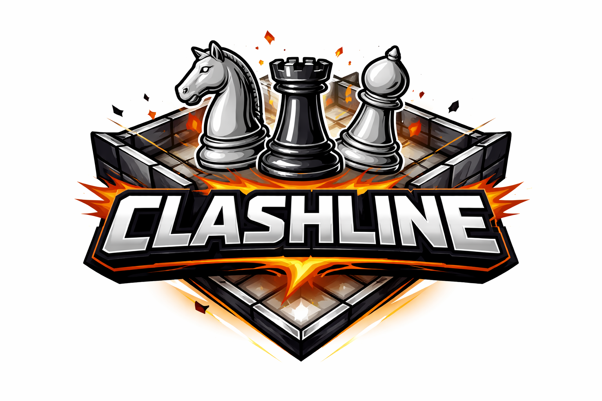
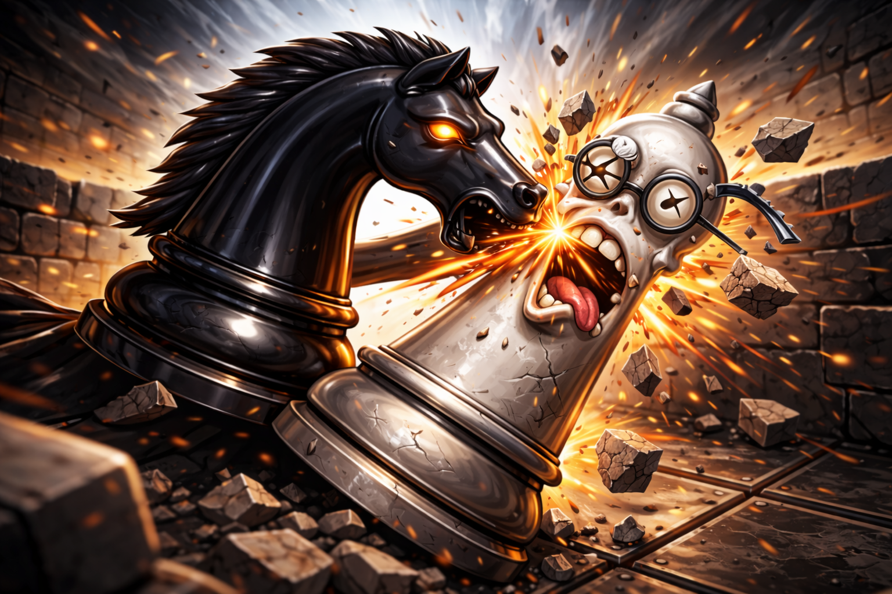
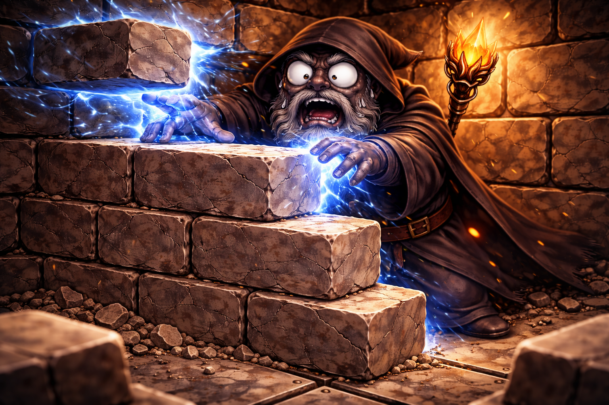
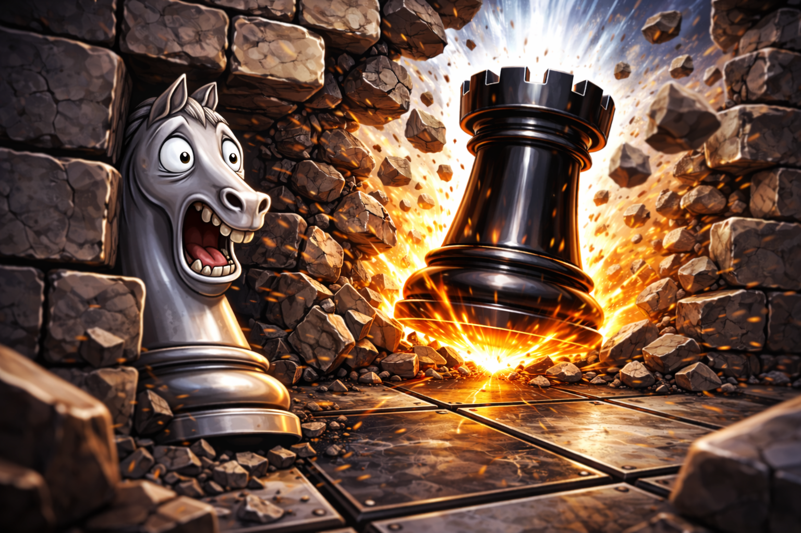

# Clashline (Chess variant)

Clashline is a tactical variant of chess that blends classic movement with arena-style board control. Each player commands a compact force: a bishop, knight, and castle — while shaping the battlefield using wall tokens that block, funnel, or open paths. On every turn, players choose how to spend two actions, balancing traditional moves with special attacks that place or destroy nearby walls. With knights able to slip through obstacles and victory achieved by total immobilization or elimination, Clashline rewards positioning, tempo, and creative use of terrain over rote openings.

## Requirements:
- Standard Chess board.
- White bishop, knight, castle.
- Black bishop, knight, castle.
- 20x Chess board grid sized tokens.

## Setup

#### Each players starts with:
- Bishop
- Knight
- Castle
- 3 tokens (walls)

#### Arena creation:
- White player places 3 tokens anywhere within middle 4 rows.
- Black player places 3 tokens anywhere within middle 4 rows.
- White player places their biship, knight and castle anywhere within their first 2 rows.
- Black player places ttheir biship, knight and castle anywhere within their first 2 rows.

#### Play begins:

Players take turns. 

White goes first.

Each turn you can chose to do up to two total actions:

- A standard Chess move of a chosen piece you control.

- Place a wall token immediately adjacent to any piece you control - capturing any piece on that square.

- Destroy a wall token that is immediately adjacent to any piece you control.

Each piece can only move once, and special attack once per turn.

#### Examples of possible turns:
- Move knight, move castle.
- Move knight, special attack with knight.
- Special attack with bishop, move castle.
- Special attack with knight, special attack with castle.

Only the knight can move through tokens (walls).

#### Play ends:

The win condition is when one player has no pieces, cannot move or forfiets. 